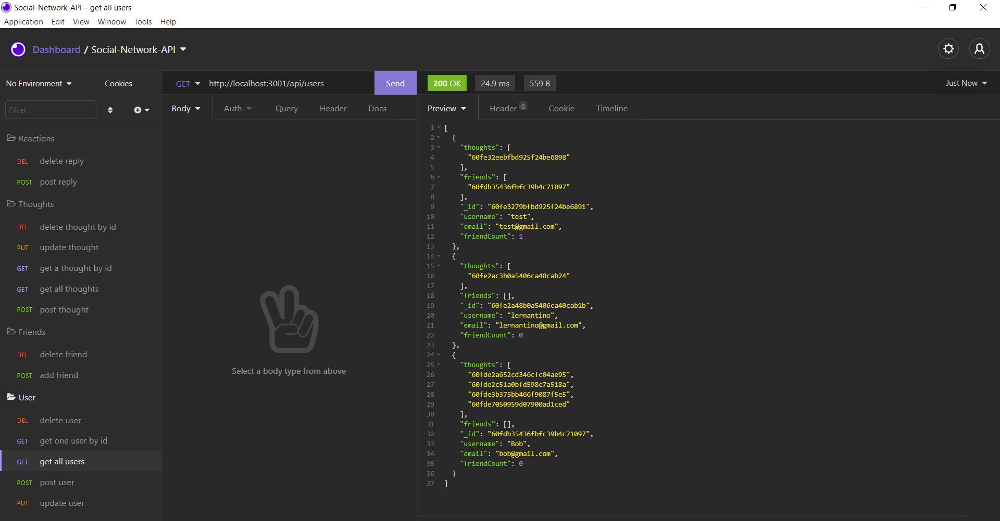

# Social-Network-API

## Purpose

This API is for a social network web application where users can share their thoughts, react to friends’ thoughts, and create a friend list.

## Built With

- JavaScript
- Node.js
- Express.js
- MongoDB
- Mongoose
- Insomnia

## Website

Link to walk-through video:
https://drive.google.com/file/d/1QHgrsQzrxti86qEZygOHmoxPytFst9Dy/view?usp=sharing

## Contribution

Made by Archita
